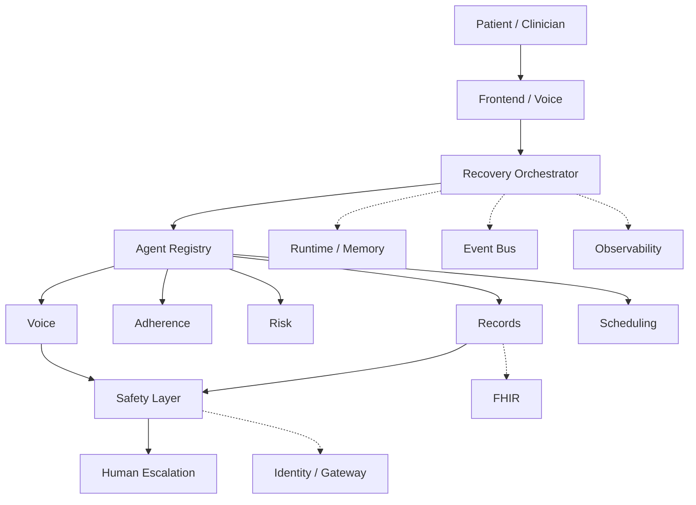

# Architecture overview

EIR is a longitudinal recovery agent fleet. A Recovery Episode is a persistent workflow that may last days or weeks. The system coordinates outreach, adherence checks, risk signals, scheduling, records access, and human escalation. It does not autonomously diagnose patients or replace clinicians.

## Conceptual architecture



```text
Patient / Clinician
        |
        v
Frontend / Voice
        |
        v
Recovery Orchestrator
        |
        v
Agent Registry
        |
  +-----+-----+------+-------+
  |     |     |      |       |
Voice Adherence Risk Records Scheduling
  |                    |
  +---------+----------+
            |
        Safety Layer
            |
       Human Escalation

--------------------------------

Runtime / Memory
Event Bus
FHIR
Observability
Identity / Gateway
```

## Process boundaries

- **frontend**: operator/clinician UI. No healthcare business logic.
- **backend**: FastAPI. Persists patients and episodes, publishes domain events. Does not run the full recovery workflow in one HTTP request.
- **agents**: Google ADK specialists. Independently testable. Do not import FastAPI.
- **shared**: event types, capabilities, and protocols (`EventBus`, `EpisodeStore`, `AgentMemory`).

## Coordination rule

The orchestrator requests the next **capability** from `AgentRegistry` (`find_by_capability`). It must not hardcode a Python call chain such as `outreach(); risk(); scheduling()`.

## Persistence model

A Recovery Episode is durable workflow state:

1. Day 0 — episode created (`RecoveryEpisodeStarted`)
2. Day 0/3 — `FollowUpDue` → outreach tools run via ADK (no pre-approval for routine contact)
3. Day 3 — patient response assessed; high-risk paths escalate and create clinician reviews
4. Day 4 — clinician resolves pending reviews → workflow resumes
5. Day 7 — episode in `WAITING_FOR_NEXT_FOLLOWUP`; Cloud Scheduler publishes the next `FollowUpDue` (Firestore idempotency markers)

Firestore/file stores and in-memory implementations are **fallback adapters**. Agent Engine Memory Bank is not claimed unless the Vertex memory adapter is active.

## Adapter rule

External systems are reached only through interfaces: FHIR, voice, event bus, identity, observability. Adapters are labeled **REAL** vs **fallback** in `docs/hackathon-compliance.md` (e.g. `FirestoreAgentMemoryFallback`, managed Model Armor vs `RegexContentGuardFallback`, `SyntheticVoiceProvider`).

Production Model Armor uses template `eir-agent-guard` in `us-central1` (separate from Gemini `global` endpoint). Managed screening status is exposed via `/api/v1/runtime/status` → `model_armor`.
