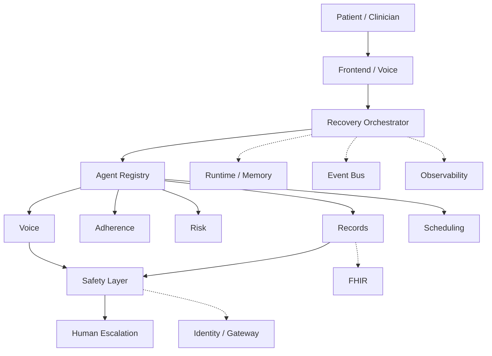

# Architecture overview

EIR is a longitudinal healthcare agent fleet. A Recovery Episode is a persistent workflow that may last days or weeks, and a Replenishment Case applies the same machinery to pharmacy supply. The system coordinates outreach, adherence checks, risk signals, scheduling, records access, and human escalation. It does not autonomously diagnose patients or replace clinicians.

## Conceptual architecture



```text
Patient / Clinician
        |
        v
Frontend / Voice
        |
        v
Recovery Orchestrator
        |
        v
Agent Registry
        |
  +-----+-----+------+-------+
  |     |     |      |       |
Voice Adherence Risk Records Scheduling
  |                    |
  +---------+----------+
            |
        Safety Layer
            |
       Human Escalation

--------------------------------

Runtime / Memory
Event Bus
FHIR
Observability
Identity / Gateway
```

## Process boundaries

- **frontend**: operator/clinician UI. No healthcare business logic.
- **backend**: FastAPI. Persists patients and episodes, publishes domain events. Does not run the full recovery workflow in one HTTP request.
- **agents**: Google ADK specialists. Independently testable. Do not import FastAPI.
- **shared**: event types, capabilities, and protocols (`EventBus`, `EpisodeStore`, `AgentMemory`).

## Coordination rule

The orchestrator requests the next **capability** from `AgentRegistry` (`find_by_capability`). It must not hardcode a Python call chain such as `outreach(); risk(); scheduling()`.

## Persistence model

A Recovery Episode is durable workflow state:

1. Day 0 — episode created (`RecoveryEpisodeStarted`)
2. Day 0/3 — `FollowUpDue` → outreach tools run via ADK (no pre-approval for routine contact)
3. Production `VOICE_PROVIDER=voximplant` starts PSTN asynchronously (`VoiceCallStarted`). `PatientResponded` arrives later from the Voximplant callback. A CLI Web Softphone preview (`callUser`) can exercise the same Gemini Live + callback path without PSTN; Cloud Run stays on PSTN.
4. Day 3 — patient response assessed; high-risk paths escalate and create clinician reviews
5. Day 4 — clinician resolves pending reviews → workflow resumes
6. Day 7 — episode in `WAITING_FOR_NEXT_FOLLOWUP`; Cloud Scheduler publishes the next `FollowUpDue` (Firestore idempotency markers)

Firestore/file stores and in-memory implementations are **fallback adapters**. Agent Engine Memory Bank is not claimed unless the Vertex memory adapter is active.

## Adapter rule

External systems are reached only through interfaces: FHIR, voice, event bus, identity, observability. Adapters are labeled **REAL** vs **fallback** in `docs/hackathon-compliance.md` (e.g. `FirestoreAgentMemoryFallback`, managed Model Armor vs `RegexContentGuardFallback`, Voximplant vs `SyntheticVoiceProvider`).

Production Model Armor uses template `eir-agent-guard` in `us-central1` (separate from Gemini `global` endpoint). Managed screening status is exposed via `/api/v1/runtime/status` → `model_armor`.

## Supply & Replenishment module

A second long-running workflow shares the platform without sharing the recovery
state machine. A **Replenishment Case** is to purchasing what a Recovery Episode
is to a patient: durable, event-sourced, and outliving any HTTP request.

```text
Cloud Scheduler → StockMonitor.process_due()
        |
        v  InventoryLevelLow
Supply Orchestrator  (same registry, same SafetyGate)
        |
        v  supply.forecast          → inventory_agent
        v  supplier.contact         → procurement_agent → supplier voice
        v  purchase_order.draft     → procurement_agent
        v  purchase_order.approve   → BLOCKED at the safety gate
        |
        v  operations authorizes  (SupplyApprovalGranted)
        v  purchase_order.approve replays → order placed
```

### Why a separate runtime

`WorkflowRuntime._handle` returns silently when no Recovery Episode matches
`episode_id`. A shared subscription would therefore swallow supply events with no
trace. Each runtime subscribes to its own slice of `EVENT_TYPE_MAP`
(`RECOVERY_EVENT_TYPES` / `SUPPLY_EVENT_TYPES`, asserted disjoint in tests), and
`SupplyWorkflowRuntime` owns `ReplenishmentCase` the way `WorkflowRuntime` owns
`RecoveryEpisode`. They share the registry, the SafetyGate, the AgentGateway, the
ADK runner, and the human-review queue.

### The spend boundary

`purchase_order.approve` is in `PRE_APPROVAL_CAPABILITIES`, so the safety gate
parks it before execution and stores the triggering event verbatim on the review.
The agent drafts and negotiates; the placed order replays only after a person
authorizes it, and records who did. This is the same deferred-execution path
`observation.write` uses on the clinical side.

Supply reviews carry `workflow="supply"` so purchase orders never appear in the
clinician queue, and `/api/v1/reviews` cannot resolve them.

### Data boundary

Stock is operational, not clinical: nothing in this module reads or writes FHIR.
Supplier calls use a dedicated `SupplierVoiceProvider` rather than the patient
outreach provider, so the synthetic-patient guard on the clinical voice path is
never widened to reach a vendor. Catalog phone numbers are in the reserved
`+1555…` fictional range and the default provider is a scripted stub that places
no calls.
