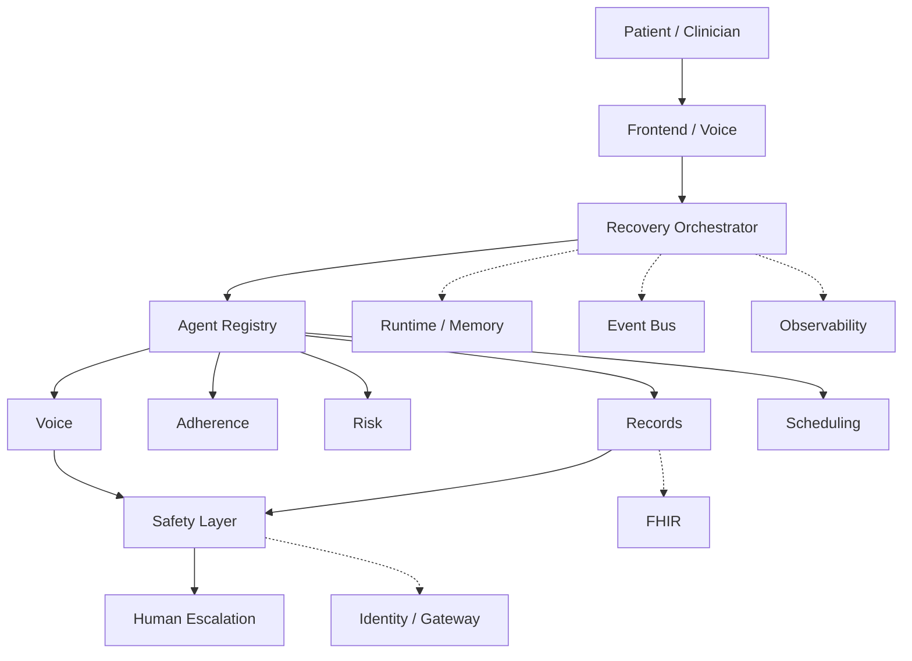

# Architecture overview

EIR is a longitudinal healthcare agent fleet. A Recovery Episode is a persistent workflow that may last days or weeks, and a Replenishment Case applies the same machinery to pharmacy supply. The system coordinates outreach, adherence checks, risk signals, scheduling, records access, and human escalation. It does not autonomously diagnose patients or replace clinicians.

## Conceptual architecture



```text
Patient / Clinician
        |
        v
Frontend / Voice
        |
        v
Recovery Orchestrator
        |
        v
Agent Registry
        |
  +-----+-----+------+-------+
  |     |     |      |       |
Voice Adherence Risk Records Scheduling
  |                    |
  +---------+----------+
            |
        Safety Layer
            |
       Human Escalation

--------------------------------

Runtime / Memory
Event Bus
FHIR
Observability
Identity / Gateway
```

## Process boundaries

- **frontend**: operator/clinician UI. No healthcare business logic.
- **backend**: FastAPI. Persists patients and episodes, publishes domain events. Does not run the full recovery workflow in one HTTP request.
- **agents**: Google ADK specialists. Independently testable. Do not import FastAPI.
- **shared**: event types, capabilities, and protocols (`EventBus`, `EpisodeStore`, `AgentMemory`).

## Coordination rule

The orchestrator requests the next **capability** from `AgentRegistry` (`find_by_capability`). It must not hardcode a Python call chain such as `outreach(); risk(); scheduling()`.

## Persistence model

A Recovery Episode is durable workflow state:

1. Day 0 — episode created (`RecoveryEpisodeStarted`)
2. Day 0/3 — `FollowUpDue` → outreach tools run via ADK (no pre-approval for routine contact)
3. Production `VOICE_PROVIDER=voximplant` starts PSTN asynchronously (`VoiceCallStarted`). `PatientResponded` arrives later from the Voximplant callback. A CLI Web Softphone preview (`callUser`) can exercise the same Gemini Live + callback path without PSTN; Cloud Run stays on PSTN.
4. Day 3 — patient response assessed; high-risk paths escalate and create clinician reviews
5. Day 4 — clinician resolves pending reviews → workflow resumes
6. Day 7 — episode in `WAITING_FOR_NEXT_FOLLOWUP`; Cloud Scheduler publishes the next `FollowUpDue` (Firestore idempotency markers)

Firestore/file stores and in-memory implementations are **fallback adapters**. Agent Engine Memory Bank is not claimed unless the Vertex memory adapter is active.

## Adapter rule

External systems are reached only through interfaces: FHIR, voice, video, event bus, identity, observability. Adapters are labeled **REAL** vs **fallback** in `docs/hackathon-compliance.md` (e.g. `FirestoreAgentMemoryFallback`, managed Model Armor vs `RegexContentGuardFallback`, Voximplant vs `SyntheticVoiceProvider`, Veo vs `UnavailableVideoClient`).

Production Model Armor uses template `eir-agent-guard` in `us-central1` (separate from Gemini `global` endpoint). Managed screening status is exposed via `/api/v1/runtime/status` → `model_armor`.

## Recovery video generation

An optional Vertex AI Veo clip that animates already-approved recovery instructions. It is an
ordinary fleet member, not a special case: `RecoveryVideoRequested` maps to
`recovery.video.generate`, the registry resolves that to the `recovery_video` descriptor, and
the orchestrator never learned a new branch.

`POST /api/v1/recovery` publishes the request as a background task rather than awaiting it —
generation takes tens of seconds, and an HTTP handler that waits for Veo is a handler that
times out. The portal renders the text instructions immediately and picks the clip up from
`RecoveryVideoReady` on a later poll.

### The prompt is Python, not a model

`build_prompt` assembles the narration from an explicit allowlist — `context` and `tasks` read
off the episode's own `RecoveryEpisodeStarted` event, falling back to the FHIR CarePlan and
then to a generic script. No LLM writes the wording, and no patient-identifying field (name,
DOB, MRN, free-text note) can reach the prompt. This is the same rule as "agents never
diagnose": the model animates approved text, it does not author clinical content.

Narration is deliberately one sentence. An eight-second clip holds roughly sixteen spoken
words, so the word budget is derived from the configured duration rather than hardcoded twice;
asking Veo to recite a numbered care plan only makes it speed-talk or truncate mid-word. A
task that mentions a medication is never spoken at all — the same rule the phone outreach
channel follows, because a generative audio channel cannot be trusted with a drug name or a
dose. The verified task list stays in the portal's text UI, which is the record.

### Cost is bounded by the server, not the button

Clips are content-addressed: the storage key is a digest of model + prompt, so every episode
seeded from the same care-plan task list shares one stored object and one Veo call, however
often the page is reloaded. Bytes scale with the number of *distinct task lists*, not with
clicks.

A deliberate "Regenerate" (`force=true`) must actually call Veo — it is the live demo control
— and lands under a per-episode `clips/adhoc/` prefix that is pruned to a single object on
write, so forcing cannot accumulate either.

Past the cache, `StoreBackedVideoQuota` enforces a per-episode cooldown and a global daily
ceiling behind the same durable stores the API and the worker share. The frontend's disabled
button is not a rate limit — a second tab or a curl loop defeats it. Quota is charged only for
work that actually reaches Veo; a cache hit is free.

### Storage stays private

Bytes are never handed to the browser as a `gs://` or public URL. They are written to our own
storage (GCS when `RECOVERY_VIDEO_BUCKET` is set, else local disk) and served back through
`GET /api/v1/recovery/{episode_id}/video/{filename}`, which re-derives the storage key from the
untrusted path and rejects any episode id or filename this module did not mint.

Local disk is laptop-only. On Cloud Run the worker that generates a clip is a different
container from the API that serves it — and the filesystem is RAM — so a deployed environment
must set a bucket.

`RECOVERY_VIDEO_ENABLED` is false by default; the composition root then wires
`UnavailableVideoClient`, which produces nothing and says so rather than pretending otherwise.
A generation that *fails* is a separate path — `VeoVideoAdapter` catches everything and returns
a labelled `VideoResult` (`timeout`, `cooldown`, `daily_limit_reached`, `no_video_bytes`,
`vertex_returned_gcs_uri`, …) instead of raising into the workflow. Either way the handler
emits `RecoveryVideoFailed` carrying the reason, and the text instructions remain primary.

Live status — configured model, storage backend, quota consumed today, last error — is at
`/health` → `adapters.recovery_video`. Note that `/api/v1/runtime/status` hand-picks its fields
and does **not** currently surface it, though it does surface `voice`.

## Supply & Replenishment module

A second long-running workflow shares the platform without sharing the recovery
state machine. A **Replenishment Case** is to purchasing what a Recovery Episode
is to a patient: durable, event-sourced, and outliving any HTTP request.

```text
Cloud Scheduler → StockMonitor.process_due()
        |
        v  InventoryLevelLow
Supply Orchestrator  (same registry, same SafetyGate)
        |
        v  supply.forecast          → inventory_agent
        v  supplier.contact         → procurement_agent → supplier voice
        v  purchase_order.draft     → procurement_agent
        v  purchase_order.approve   → BLOCKED at the safety gate
        |
        v  operations authorizes  (SupplyApprovalGranted)
        v  purchase_order.approve replays → order placed
```

### Why a separate runtime

`WorkflowRuntime._handle` returns silently when no Recovery Episode matches
`episode_id`. A shared subscription would therefore swallow supply events with no
trace. Each runtime subscribes to its own slice of `EVENT_TYPE_MAP`
(`RECOVERY_EVENT_TYPES` / `SUPPLY_EVENT_TYPES`, asserted disjoint in tests), and
`SupplyWorkflowRuntime` owns `ReplenishmentCase` the way `WorkflowRuntime` owns
`RecoveryEpisode`. They share the registry, the SafetyGate, the AgentGateway, the
ADK runner, and the human-review queue.

### The spend boundary

`purchase_order.approve` is in `PRE_APPROVAL_CAPABILITIES`, so the safety gate
parks it before execution and stores the triggering event verbatim on the review.
The agent drafts and negotiates; the placed order replays only after a person
authorizes it, and records who did. This is the same deferred-execution path
`observation.write` uses on the clinical side.

Supply reviews carry `workflow="supply"` so purchase orders never appear in the
clinician queue, and `/api/v1/reviews` cannot resolve them.

### Data boundary

Stock is operational, not clinical: nothing in this module reads or writes FHIR.
Supplier calls use a dedicated `SupplierVoiceProvider` rather than the patient
outreach provider, so the synthetic-patient guard on the clinical voice path is
never widened to reach a vendor. Catalog phone numbers are in the reserved
`+1555…` fictional range and the default provider is a scripted stub that places
no calls.
